# ☕ RareFriends Cafe

*Your Rare Friend opens a shop on a quiet greyscale street. Your other Friends staff it, and every day ends with a picture worth posting.*

**▶ Play: https://m4s4t0-v01d.github.io/rarefriends-cafe/** · **Preview page: https://m4s4t0-v01d.github.io/rarefriends-cafe/preview/**
*(You need a browser wallet on Robinhood mainnet holding a hardwired Rare Friends Generations NFT.)*

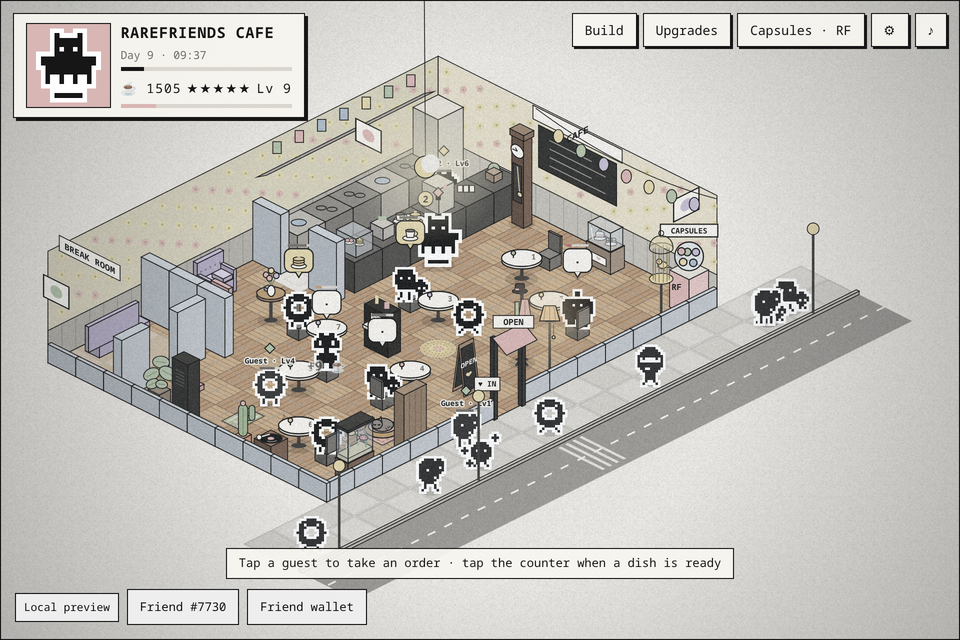

- **Your Friend is the manager.** The Friend you select appears with its canonical on-chain sprite and a gameplay perk from its Generations family.
- **Your other Friends are the staff.** Every other eligible Friend in your wallet can work as a waiter, chef or promoter. Their tier comes from their on-chain generation (Gen 1 is best, Gen 6 the lowest), and they level up as they work, earning a point per level for **speed, stamina or skill**. Chefs work their way along the stoves, fridge, sink and prep top while dishes cook, then carry each dish to the pass. When staff get tired, you send them to the break room.
- **The street is alive, and so is the world around it.** Friends stroll down a long street and round the corner, and some walk in through your door. Two roads meet at your corner: the main road past the door and a side road along the other front, each with sidewalks, curbs, crossings and street lamps. Dress the world beyond your walls with one of eight sceneries, from a cottage garden to a night market, with leafy shaded trees, flowers, rocks and grass. Neighbouring shops line both roads, with Friends coming and going through their doors. **Drag** to look around, **scroll or pinch** to zoom, and **turn the whole view** a quarter at a time.
- **Groups come in together.** Tables for one, two and four: a party sits down together and one tap takes the whole table's order.
- **Make it yours.** Pick a café, seafood restaurant, pastry shop, burger diner or Asian noodle house, and one of seven **buildings**: a corner café, a long diner, a townhouse with its kitchen on the back wall, a café with a front parlour, a slim bistro, an **L-shaped café** round a paved patio, or a **U-shaped café** with its kitchen in the middle of the U. Arrange 40 kinds of furniture and décor, from a little cactus to a grand piano, a koi pond and a mini carousel, **turning any piece four ways** (even after it's placed). Move the capsule machine, choose from 12 wallpapers and 12 floors, and expand ten times, up to 20 × 20.
- **A slow, cosy climb.** Five-minute days, 22 café levels, **nineteen dishes per shop** (the last seven, the master menu, unlock one a level from 16 to 22), thirteen upgrade tracks (including a **second pass** on the counter, so dishes get out faster), manager skill points every level, worker attribute points, and three **daily challenges**. **Random events** keep days different: a food critic, a celebrity Friend, a tour bus, a rain shower, a lunch rush or a kitchen hiccup.
- **It sounds alive too.** Sixteen procedural tracks (swing, bossa, jazz waltz and lo-fi) playing eleven composed melodies in song form, with ⏮ ⏭ skip buttons, a *now playing* card in the corner and an optional shuffle that changes the song every few minutes, a coffee-ready chime, a door bell, and Friends who chirp, sigh and yawn.
- **$RAREFRIENDS capsules.** Rare Capsules cost (simulated) RF. Each one holds a secret recipe, which you keep for a boost or redeem for RF, plus one of 8 RF-exclusive collectibles for your shop. Capsules also pay for **RF boosts** (tireless staff, a perfect-service day, a street festival, a golden hour) and **RF sceneries** (seaside, snowy village, cherry blossom lane, night market).
- **Comfy to play:** pause any time (⏸ / Esc), purchases ask first, dark mode, thick themed scrollbars, and an in-game update log.
- **Every manager has their own shop.** Progress saves per managing Friend (by token number): pick another of your Friends as manager and you open a brand-new shop; switch back and the first one is waiting. Each day's report card is ready to **post on X**, tagged *@RareFriendsNFT #RareFriends #RareFriendsCafe*.

| | |
| --- | --- |
| **Builder** | M4S4T0 · [@M4S4T0-V01D](https://github.com/M4S4T0-V01D) |
| **Category** | Character Spotlight (primary) · Economy Potential · Token Activity |
| **Stack** | [FriendSDK v0.1.3](https://github.com/spokesz/friendsdk/tree/v0.1.3) · React 19 · Canvas 2D · WebAudio · TypeScript |
| **Economy** | Simulated. Capsules use the SDK's preview RF ledger; no contracts or transactions. |
| **Wallet / network** | Browser wallet on **Robinhood mainnet (chain 4663)** holding a hardwired Generations NFT (generation ≥ 1) |

## Screenshots

| The world outside (zoomed out) | Seven buildings | Staff: tiers, levels, attribute points |
| --- | --- | --- |
| 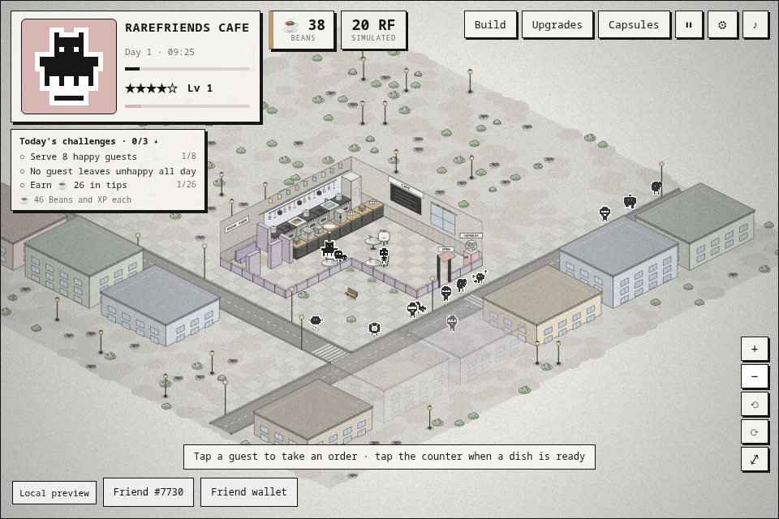 | 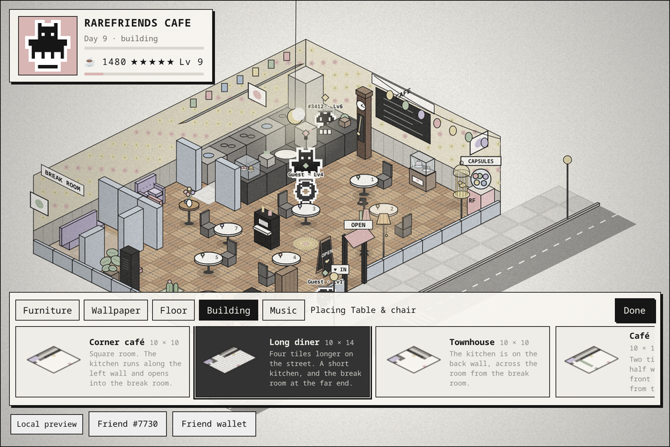 |  |
| **Build mode: Tables, Rugs, Décor, Turn** | **Upgrades** | **Your manager's skills** |
|  | 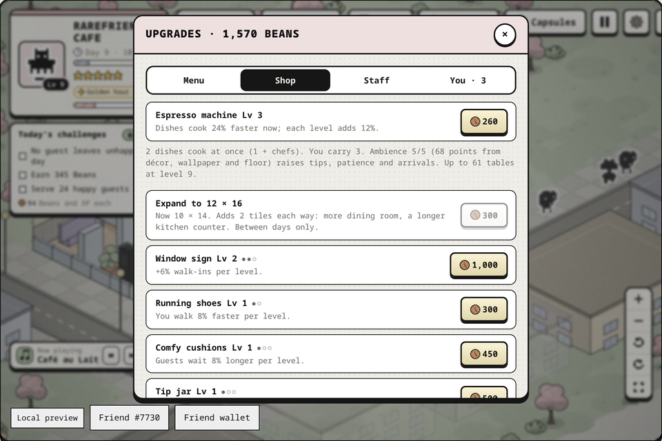 | 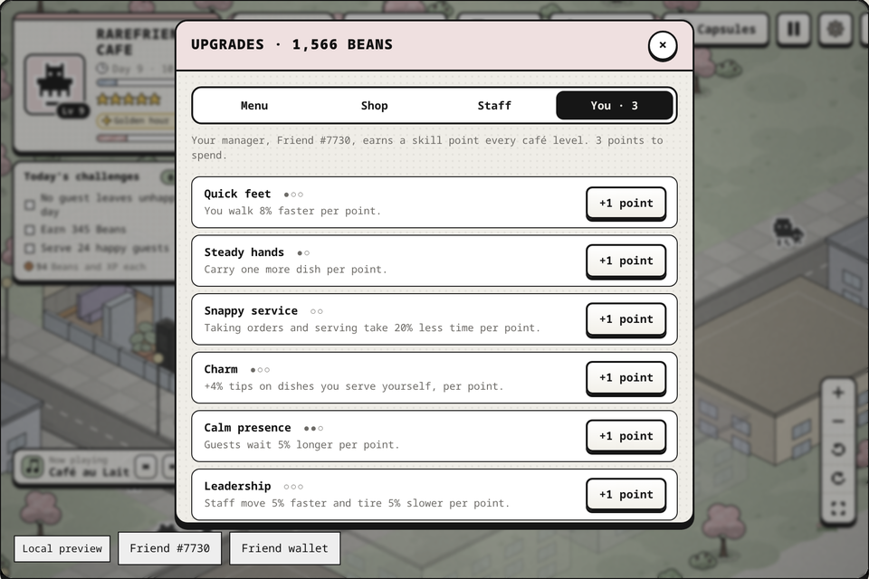 |
| **RF boosts and sceneries** | **Buy only when you mean it** | **Dark mode** |
| 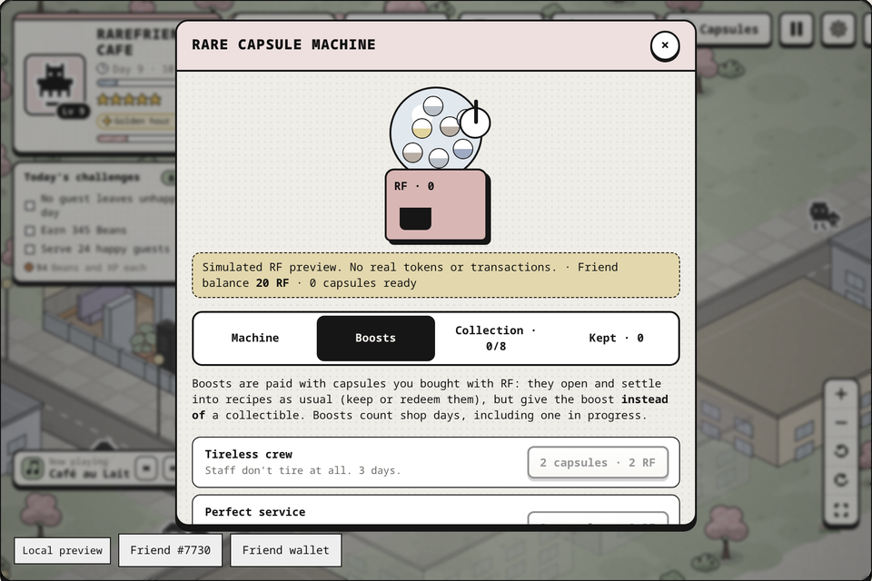 | 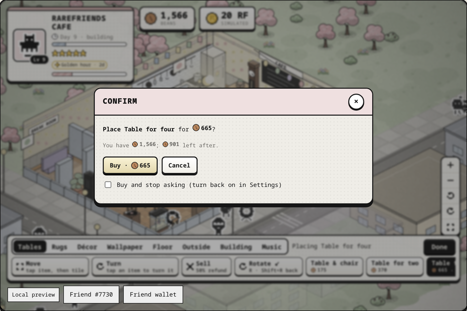 | 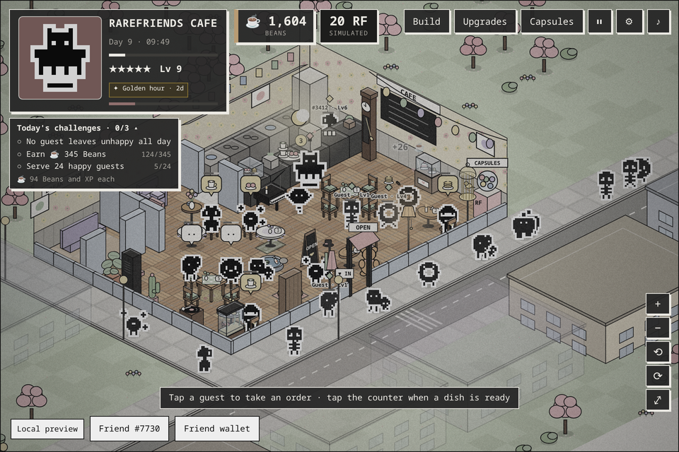 |
| **The view turned a quarter** | **L-shaped café with a patio** | |
| 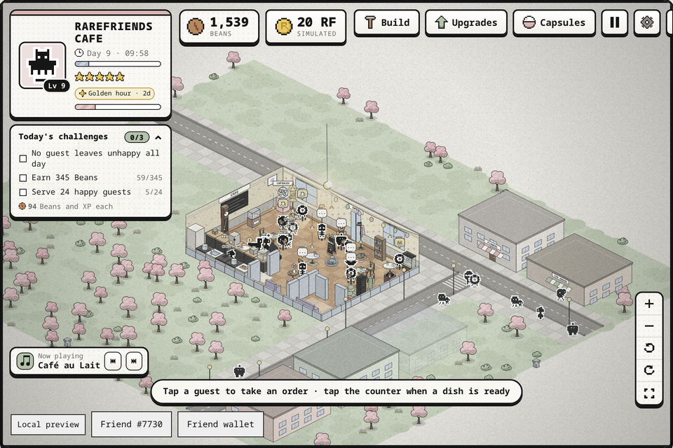 | 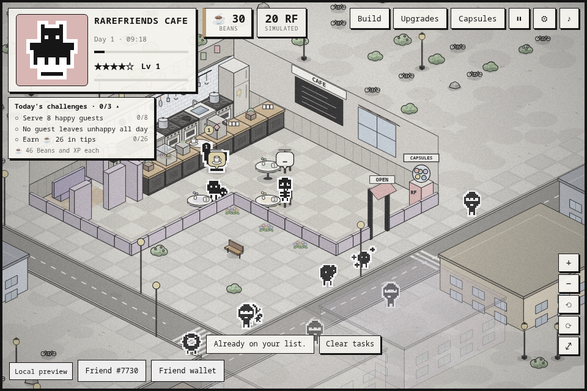 | |
| **Choose your shop** | **Your owned Friend cooking** | **Rare Capsule Machine** |
|  |  | 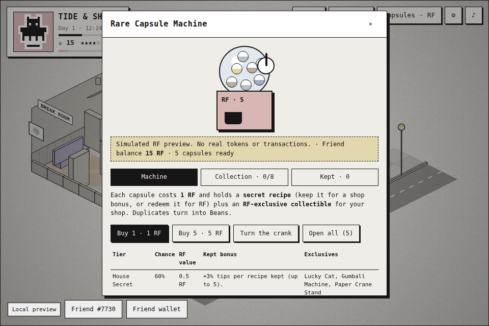 |
| **Five capsules opened** | **RF-exclusive collection** | **Saved per manager** |
| 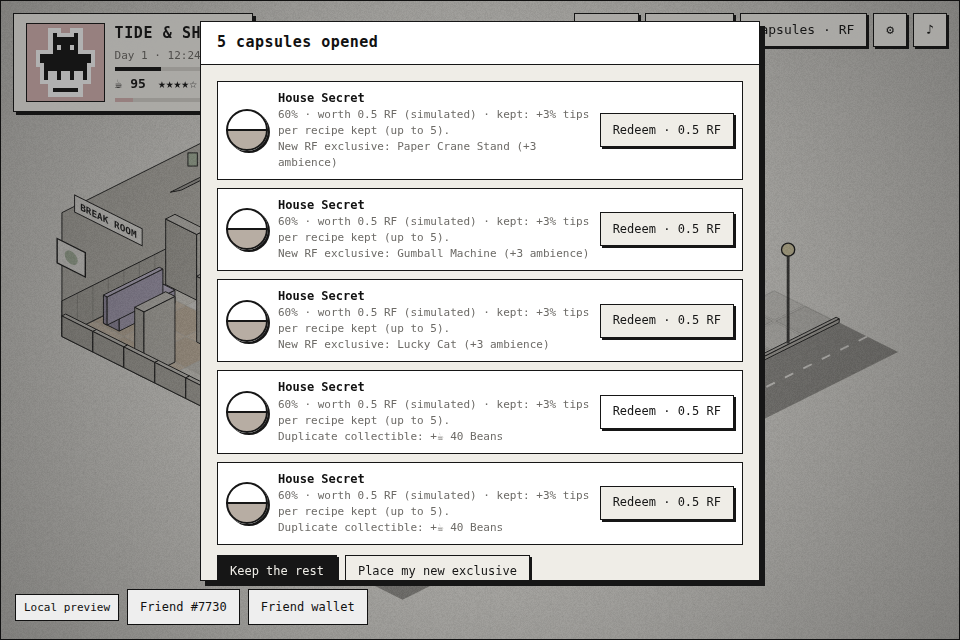 | 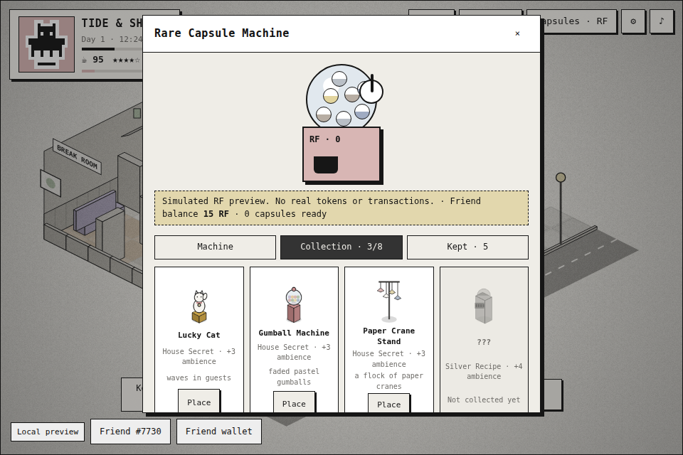 |  |

**The end-of-day card, ready to post on X:**

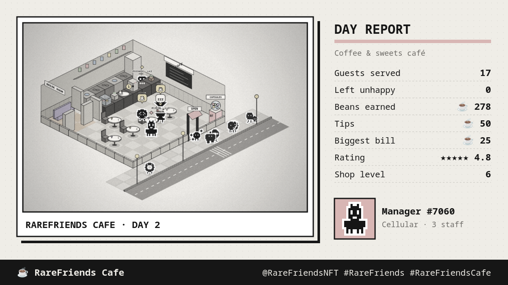

## How it plays

1. **Choose your shop** and your building, and open for the day. Friends walk the street; some come in and sit down, alone or as a party.
2. **Tap a guest** (or press their table number) to take the whole table's order. When the counter bell rings, **tap the counter**, and your manager picks up and delivers.
3. Fast service earns **tips in Beans**. Spend them on dishes, kitchen upgrades, the shop upgrades, staff slots, furniture, designs, sceneries and expansions. Finish the day's three **challenges** for bonus Beans, and make the most of random events.
4. **Staff:** give your Friends a role. **Waiters** serve, **chefs** cook in the kitchen, and **promoters** work the sidewalk. They level up as they work; spend each level's point on speed, stamina or skill. When one shows a *zzz*, **tap them** (or press **T**) to send them to the break room for 15–30 s.
5. **Build (B):** place, move, turn and sell furniture (**R**, **Shift+R** back, or the **Turn** tool on anything placed). Move the capsule machine, pick wallpaper, floors, the scenery outside, music and your building (between days), and place your RF exclusives.
6. At closing you get a **day summary** and **day card**: **Post to X**, **Copy picture** or **Save picture**. Your shop saves for your wallet.
7. **Rare Capsule Machine:** buy ×1 or ×5 and turn the crank. You get recipes (kept for bonuses or redeemed for RF) and exclusives such as the Chrome Jukebox, which unlocks a jazz track, or the Golden Friend Statue of your manager.

Full rules, numbers and controls: [games/rarefriends-cafe/README.md](games/rarefriends-cafe/README.md).

## How it uses Rare Friends and $RAREFRIENDS

**Character Spotlight.** The verified Generations NFT is the star: the manager on the floor (a larger sprite) and in
the HUD portrait, drawn from its **canonical on-chain sprite**, with a **family perk**. Owning more Friends matters too.
Each one can join your staff with its canonical art and token number. Its **on-chain generation sets its worker tier**
(Gen 1 legendary … Gen 6 rookie), and it earns worker levels over time. The Golden Friend Statue immortalises your
manager in gold.

**Token Activity / Economy Potential.** Every RF action goes through the SDK's reviewed chance-game client. It is
**simulated and clearly labelled**:

- **RF sink:** a Rare Capsule costs 1 RF and returns 0.88 RF in expected value. 12% of each purchase stays with the game as prize stake. Buying ×5 is supported.
- **Keep or redeem:** recipes keep a fixed RF value with no expiry, but only boost your shop while you keep them. This fits the SDK's backing model: each capsule reserves 5 RF.
- **Collectibles:** every capsule also grants one of 8 RF-exclusive items. They add ambience, and the Jukebox and Telescope unlock music tracks. They are saved with your shop and carry no RF value, so they need no prize reserve. Duplicates turn into Beans.
- **RF boosts and sceneries, paid with capsules:** SDK v0.1.3 has no generic "spend RF on an upgrade" action, so boosts and RF sceneries are paid with capsules you bought with RF. They still open and settle through the SDK (you keep or redeem their recipes), but give the boost or scenery instead of a collectible. Boosts: *Tireless crew* (2 capsules, staff don't tire for 3 days), *Perfect service* (2, no unhappy guests for a day), *Street festival* (3, twice the passers-by for 2 days), *Golden hour* (3, dishes pay 25% more for 2 days). Sceneries: *Seaside* and *Snowy village* (3), *Cherry blossom lane* (4), *Night market* (5), kept for good.
- **Two currencies:** Beans are earn-only, so the game is fun without spending. RF gives access to specials, VIP guests, exclusives, boosts and sceneries. It's a boost, not a paywall.
- **Holding more Friends pays off in game:** owned staff outperform guests, and better generations outperform worse ones.

**Future integrations** (not in the SDK v0.1.3 API):

| Idea | Needs |
| --- | --- |
| Cloud saves across devices | A save/persistence API (today: per-device local storage) |
| RF-priced premium décor and seasonal themes, part burned | An upgrade/cosmetic purchase action with RF burn |
| Live capsules with Dice RNG | The existing live chance-game contract flow, after Rare Friends review |
| Visiting another holder's shop and tipping in RF | Cross-player actions/transfers |
| Hiring another holder's Friend as staff, with revenue share | Revenue-share / creator-fee APIs |

## Run it

Needs **Node.js 22+**, npm and Git. On Windows, use WSL2 Ubuntu, as the FriendSDK README describes.

```sh
git clone https://github.com/M4S4T0-V01D/rarefriends-cafe.git
cd rarefriends-cafe
npm ci
npm run dev            # http://localhost:4173   ·   npm run dev:lan to play from a phone on the same Wi-Fi
npm run build          # static site → games/rarefriends-cafe/.friendsdk/
npm run build:preview  # the /preview/ page (with its Street Bossa record button) → .friendsdk/preview/
```

On a phone, open the Pages link in a wallet app's in-app browser (for example MetaMask Mobile). Landscape gives the
biggest shop. FriendSDK is vendored as `vendor/rarefriends-friendsdk-0.1.3.tgz`, packed from the official `v0.1.3` tag
(see [NOTICE.md](NOTICE.md)). `.github/workflows/pages.yml` runs every check below and deploys to GitHub Pages on
each push to `main`.

## Checks

```sh
npm run typecheck      # tsc strict (game + host)
npm test               # 46 engine tests: plan and routing (all four buildings at every size), street and corner
                       # walk-ins, service loop, group tables ordering together, day cycle, placement and four-way
                       # rotation, the moving capsule machine, chefs carrying dishes, expansions and staff slots,
                       # building switches, upgrades, manager skills, RF boosts, sceneries, daily challenges,
                       # random events, late-game content, generation tiers, worker XP and attribute points,
                       # roles, fatigue and breaks, saves and migration, capsule collectibles, melodies, music
                       # unlocks, X post text, the slower economy and the capsule economy table
npm run check          # friendsdk check
npm run test:browser   # SDK mock-wallet browser runs:
                       #  • 960 px: shop pick, keyboard service, build (pointer + keyboard), floor + music tabs, staff,
                       #    capsules ×5 buy → open all → collection → place, sound toggle
                       #  • 360 px touch: audio audible after a touch start, service, build bar
                       #  • custom host: two-Friend wallet → #3412 as chef with canonical art, a full day to closing,
                       #    day card + Post to X (prefilled post + picture copied), save and reload → "Welcome back"
                       #  • preview page: the record button plays Street Bossa audibly on click and tap, and stops
```

The mock wallet exists only in tests. `dev` and public builds always use the real ownership gate.

**Real-wallet playtest:** the builder has playtested extensively with a real wallet on Robinhood mainnet: owned Friends
hired as staff and levelling up, closing and reloading to pick the shop back up, and the day card (the one above
is from that play).

## How the host extends the SDK

The runtime page is the SDK's own **`GameHost`**: wallet connection, owned-Friend picker, fresh
`readGenerationEligibility` check, simulated ledger, confirmations and the `allow-scripts` sandbox.
`host/runtime.tsx` adds three things the SDK doesn't supply:

1. **Owned-Friend roster.** A read-only watcher (`eth_accounts` only) runs the SDK's account-filtered `readOwnedFriends`. The roster includes each Friend's generation, and it never scans the collection.
2. **A save per manager** in the trusted page's `localStorage` (the sandbox has no storage), keyed by the managing Friend's token number, and read or written only while that Friend is in the connected wallet. A save from before v1.8 (one per wallet) moves to the first manager who opens the game from that wallet.
3. **Sharing the day card.** On your click, the page uses the share sheet (phones) or copies the picture and opens a prefilled X post (desktop). X post links can't carry images, so you paste it. Nothing posts without you pressing Post.

The game receives the roster and save only over `postMessage` from its parent window. It uses them only if the
roster contains the manager the runtime just verified. There are no signatures, transactions or extra wallet prompts.
Under the plain SDK CLI (`npx friendsdk dev` / `test`), the game runs without these extras.

## Known issues and limitations

- Saves live in this browser on this device, keyed by the manager's token number. They are client-side, so a determined player could edit their own simulated Beans.
- Capsule RF balances and kept recipes live in the SDK's session ledger and reset on reload. Collectibles are saved.
- Guest Friends are procedural art in the Rare Friends style, not specific tokens. The roster needs the RPC to return the wallet's transfer history; guest applicants work regardless.
- Audio is synthesized in the browser and starts on your first tap. On iPhones before iOS 17, silent mode may keep it quiet.
- Wallet support is the SDK's (injected / EIP-6963; no WalletConnect).

## Credits

Built for the Rare Friends Vibeathon by **M4S4T0** ([@M4S4T0-V01D](https://github.com/M4S4T0-V01D)) with an AI coding agent.
FriendSDK, the Rare Friends artwork and the SDK sound kit are by Rare Friends; see [NOTICE.md](NOTICE.md). Scenery, furniture,
dish icons, guest Friends and all music and sound effects are original procedural code.
Gameplay inspired by café management games such as *Moe Girl Cafe 2*. No assets from them are used.
