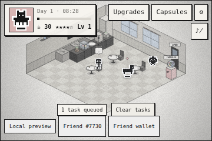

# ☕ RareFriends Cafe

*A black-and-white café sim with faded colours, where your Rare Friend runs the shop and other Rare Friends are the customers.*

RareFriends Cafe is a Rare Friends take on **Moe Girl Cafe 2**: a 2.5D isometric café management
game for the [Rare Friends Vibeathon](https://github.com/spokesz/rarefriends-vibeathon). Connect a
wallet, pick a Rare Friend you own, and that Friend becomes the café manager. The manager uses
their canonical on-chain sprite and gets a perk from their Generations family. Take orders, run
dishes from the kitchen, earn tips, and grow a bare room into a lantern-lit café with a record
player and a moon chandelier. Hire helper Friends and chefs along the way. Rare Blend Capsules
connect the café to **$RAREFRIENDS**: they cost RF, and each blend you keep boosts the café.


| | |
| --- | --- |
| **Category** | Character Spotlight (primary) · Economy Potential · Token Activity |
| **Stack** | [FriendSDK v0.1.2](https://github.com/spokesz/friendsdk/tree/v0.1.2) CLI game · React 19 · Canvas 2D · TypeScript |
| **Viewport** | SDK default 960 × 640 frame (3:2). Keyboard, mouse and touch. |
| **Economy** | Simulated. Capsules use the SDK's preview RF ledger; no live contracts or transactions. |
| **Requirements to play** | Browser wallet on **Robinhood mainnet (chain 4663)** holding a hardwired Rare Friends Generations NFT (generation ≥ 1) |

## How it plays

1. **Open the café.** Guest Friends (procedural 1-bit Friends, one style per family) walk in and sit down. Regulars #7730 and #3412 drop by too.
2. **Tap a guest** to take their order. A bubble shows the dish and a patience bar.
3. The kitchen cooks it. When the counter bell rings, **tap the counter**: your Friend picks up and delivers on their own.
4. Faster service means bigger **tips in Beans**. Spend Beans on new dishes (up to omurice with a ketchup heart), tables, espresso machine levels, ambience décor, **helper Friends** who serve on their own, and **chef Friends** who add kitchen slots.
5. At closing time, a **day summary** shows guests served, tips and rating. Then open the next day.
6. Tap the **capsule machine** for **Rare Blend Capsules** (1 simulated RF each). Keep a blend for a café bonus: better tips, a Silver Latte or Moonlight Parfait special, or **Genesis VIP** guests who pay 3×. Or redeem it for its fixed RF value.

| Rare Blend Capsule | Upgrades | Phone (360 px) |
| --- | --- | --- |
|  |  |  |

Exact rules, costs, odds and controls are in [games/rarefriends-cafe/README.md](games/rarefriends-cafe/README.md).

## Run it

Needs **Node.js 22+**, npm and Git. On Windows, use WSL2 Ubuntu as the FriendSDK README describes.

```sh
git clone https://github.com/M4S4T0-V01D/rarefriends-cafe.git
cd rarefriends-cafe
npm ci
npm run dev            # http://localhost:4173
```

Open the URL in a browser with your wallet. Choose **Connect wallet**, switch to Robinhood if
asked, pick your Friend, then **Open the café**.

**On your phone (same Wi-Fi):**

```sh
npm run dev:lan        # serves on 0.0.0.0:4173
```

On the phone, open `http://<your-computer-LAN-IP>:4173` in a wallet's in-app browser
(for example MetaMask Mobile). The wallet must hold an eligible Friend on Robinhood mainnet.
Landscape gives the biggest café. Portrait works too, with a compact HUD.

The FriendSDK is vendored as `vendor/rarefriends-friendsdk-0.1.2.tgz`, packed from the official
`v0.1.2` tag (see [NOTICE.md](NOTICE.md)), so `npm ci` needs no extra download step.

## Build and share a preview

```sh
npm run build          # → games/rarefriends-cafe/.friendsdk/
```

Upload the **contents** of `games/rarefriends-cafe/.friendsdk/` to any static HTTPS host.
`.github/workflows/pages.yml` does this automatically: every push to `main` runs the checks
and deploys to GitHub Pages. To turn it on, go to **Settings → Pages → Source: GitHub Actions**.
GitHub Pages on a *private* repository requires a paid GitHub plan. Make the repository public
before submitting so judges can see the source and play the preview.

## Checks

```sh
npm run typecheck      # tsc strict
npm test               # engine unit tests (serve loop, patience, day cycle, purchases, helpers, blends, perks, economy table)
npm run check          # friendsdk check: game.json economy + sandbox/source boundary
npm run test:browser   # SDK mock-wallet browser harness: desktop keyboard serve loop, capsule buy→open→keep, upgrades,
                       # settings/mute, and a 360px touch run. Screenshots go to ./artifacts/
```

`test:browser` needs Playwright's Chromium (`npx playwright install chromium`). The mock wallet
exists only in that harness. `dev` and public builds always use the real ownership gate.

## How it uses Rare Friends and $RAREFRIENDS

**Character Spotlight.** The selected, freshly verified Generations NFT is the main character.
It appears as the manager on the floor, at 4× scale with an apron tag, and as a portrait in the
HUD, both drawn from its **canonical on-chain sprite**. Its **family sets a gameplay perk**:
Hoverer floats faster, Colossus calms guests, Cellular carries three dishes, and so on for all
nine families. Switching Friends in the runtime changes the café's personality. Guests and
helpers are Rare Friends too, which keeps the whole café in the collection's 1-bit style.

**Token Activity / Economy Potential.** In this MVP, every RF interaction goes through the SDK's
reviewed chance-game client. It is **simulated and clearly labelled**:

- **RF sink:** a capsule costs 1 RF and has an expected value of 0.88 RF. 12% of each purchase stays with the game as prize stake.
- **Keep-or-redeem tension:** each blend has a fixed RF value with no expiry, but it only boosts the café while you keep it. Redeeming trades gameplay power for RF. This fits the SDK's backing model: each capsule reserves 5 RF, and kept blends keep their backing.
- **Two-currency design:** Beans are an earn-only soft currency, so the café stays fun without spending. RF gives access to rarer specials and VIP guests. It stays a boost, not a paywall.

**Future integrations** (not in the SDK v0.1.2 API, documented for the on-chain phase):

| Idea | Needs |
| --- | --- |
| Persistent café saves per Friend | A save/persistence API |
| RF-priced décor sets and seasonal menus, with a share burned | An upgrade/cosmetic purchase action with RF burn |
| Live capsules with Dice RNG | The existing live chance-game contract flow (`--deployment`), after Rare Friends review |
| Café visiting: your Friend eats at another holder's café and tips in RF | Cross-player actions/transfers |
| Staff contracts: hire another holder's Friend as a helper and share Bean or RF revenue | Revenue-share / creator-fee APIs |

## Known issues and limitations

- Progress (Beans, levels, upgrades) resets on reload because the SDK sandbox has no storage or save API. Capsule balances also last only for the runtime session.
- Guest Friends are procedural art in the Rare Friends style, not specific tokens. The game never scans the collection, as the SDK rules require. Only the two SDK sample Friends appear as canonical regulars.
- The browser harness uses the SDK's mocked wallet and RPC. A real-wallet playtest on Robinhood mainnet is still required before submission; it was not possible from the build environment.
- Wallet support is the SDK's: injected and EIP-6963 browser wallets. WalletConnect is not supplied, so phones need a wallet with an in-app browser.
- No real RF moves anywhere. There are no contracts, signatures or transactions.

## Credits

Built for the Rare Friends Vibeathon by **M4S4T0** ([@M4S4T0_V01D](https://x.com/M4S4T0_V01D)) with an AI coding agent.
FriendSDK, the Rare Friends artwork and the sound kit are by Rare Friends; see [NOTICE.md](NOTICE.md).
Inspired by *Moe Girl Cafe 2*. No assets from that game are used.
