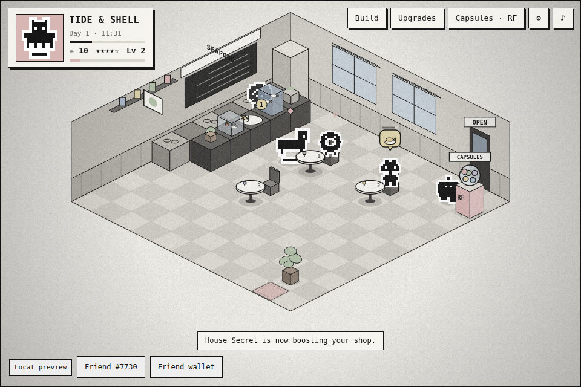
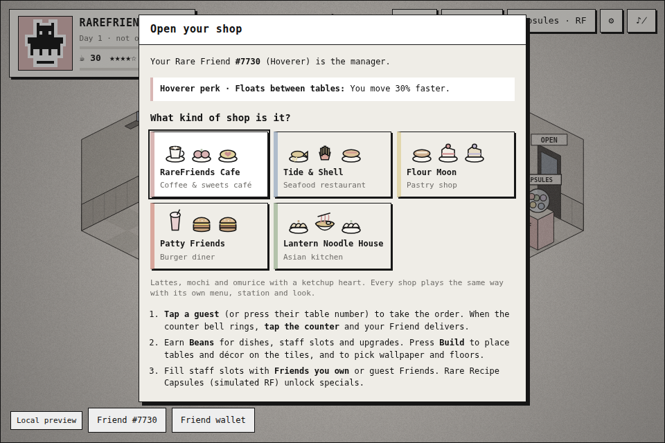
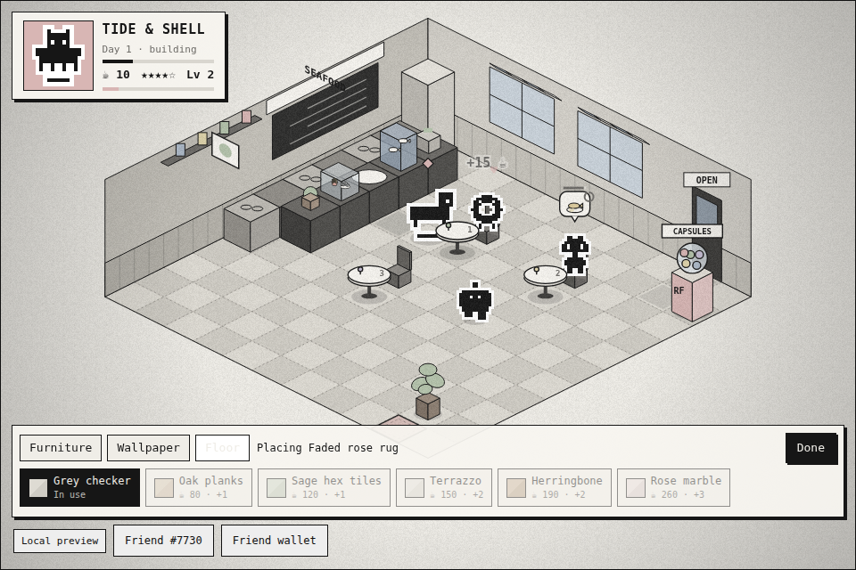
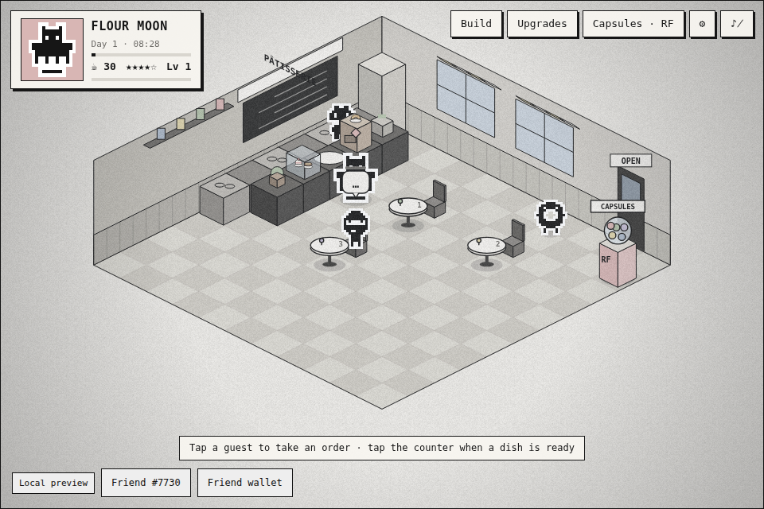
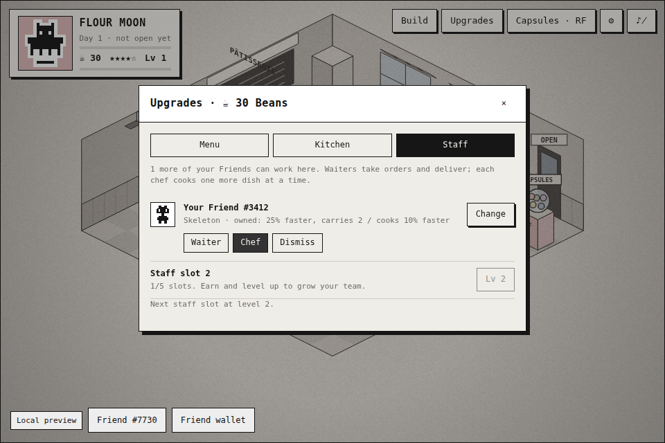
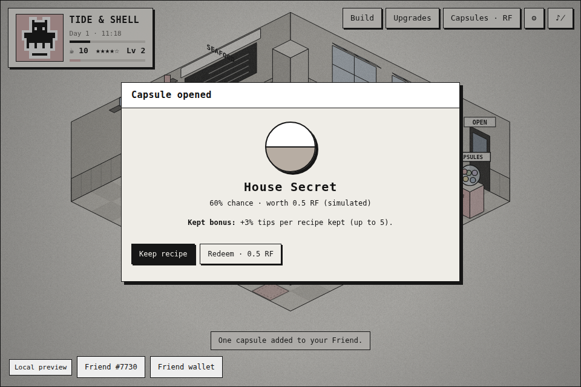
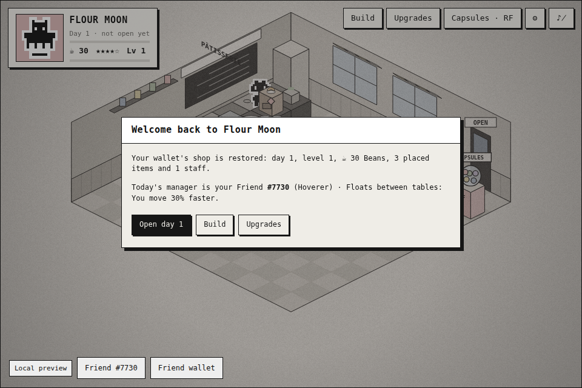

# ☕ RareFriends Cafe

*Run your own black-and-white, faded-colour shop with the Rare Friends you own.*

**▶ Play: https://m4s4t0-v01d.github.io/rarefriends-cafe/**
*(You need a browser wallet on Robinhood mainnet holding a hardwired Rare Friends Generations NFT.)*



RareFriends Cafe is a Rare Friends take on **Moe Girl Cafe 2**: a 2.5D isometric shop management
game for the [Rare Friends Vibeathon](https://github.com/spokesz/rarefriends-vibeathon).

- **Your Friend runs the shop.** Connect your wallet and pick a Rare Friend you own. It becomes the manager, shown with its canonical on-chain sprite and a perk from its Generations family.
- **Your other Friends work there.** Every other eligible Friend in your wallet can fill a staff slot as a waiter or chef, drawn with its own canonical sprite. Owned staff are faster than guest applicants. Unlock more slots (1 → 5) as you earn and level up.
- **Pick your shop:** coffee & sweets café, seafood restaurant, pastry shop, burger diner or Asian noodle house. Each has its own 9-dish menu, dish art and kitchen station.
- **Make it yours:** build mode on an 11 × 11 tile grid. Place, rotate, move and sell tables, plants, lamps, bookshelves, a record player, a piano and rugs. Choose from 6 wallpapers and 6 floor designs.
- **Keep your progress:** your shop saves automatically for your wallet address, and reconnecting brings it back.
- **$RAREFRIENDS:** Rare Recipe Capsules cost (simulated) RF. Keep a recipe for a shop bonus or redeem it for its RF value.

| | |
| --- | --- |
| **Builder** | M4S4T0 · [@M4S4T0-V01D](https://github.com/M4S4T0-V01D) |
| **Category** | Character Spotlight (primary) · Economy Potential · Token Activity |
| **Stack** | [FriendSDK v0.1.2](https://github.com/spokesz/friendsdk/tree/v0.1.2) · React 19 · Canvas 2D · TypeScript |
| **Viewport** | SDK 960 × 640 frame (3:2). Keyboard, mouse and touch. |
| **Economy** | Simulated. Capsules use the SDK's preview RF ledger; no contracts or transactions. |
| **Wallet / network** | Browser wallet on **Robinhood mainnet (chain 4663)** holding a hardwired Generations NFT (generation ≥ 1) |

| Choose your shop | Build mode | Your owned Friend as chef |
| --- | --- | --- |
|  |  |  |
| **Staff slots** | **Rare Recipe Capsule** | **Welcome back (saved per wallet)** |
|  |  |  |

## How it plays

1. **Choose your shop** and open for the day. Guest Friends walk in and sit down; regulars #7730 and #3412 drop by too.
2. **Tap a guest** (or press their table number) to take the order. A bubble shows the dish and a patience bar.
3. When the counter bell rings, **tap the counter**. Your Friend picks up and delivers on their own. Tasks queue up, so tap several guests in a row.
4. Fast service means bigger **tips in Beans**. Spend Beans on dishes, kitchen station levels, staff slots, furniture and designs.
5. **Staff:** put your own Friends (or guest applicants) in slots as waiters, who serve on their own, or chefs, who add kitchen slots.
6. **Build (B):** arrange tables and décor on the tile grid. Placements that would block guests or staff are refused. Décor, wallpaper and floors raise **ambience** for better tips, patience and more guests.
7. At closing, a **day summary** shows guests served, tips and rating. Your progress is saved, so open the next day now or come back later.
8. Tap the **capsule machine** for **Rare Recipe Capsules** (1 simulated RF each). Keeping a recipe unlocks your shop's silver or moonlight special, tip bonuses, or Genesis VIP guests who pay 3×. Or redeem it for its fixed RF value.

Full rules, costs, odds and controls: [games/rarefriends-cafe/README.md](games/rarefriends-cafe/README.md).

## Run it

Needs **Node.js 22+**, npm and Git. On Windows, use WSL2 Ubuntu, as the FriendSDK README describes.

```sh
git clone https://github.com/M4S4T0-V01D/rarefriends-cafe.git
cd rarefriends-cafe
npm ci
npm run dev            # http://localhost:4173
```

Open the URL in a browser with your wallet. Choose **Connect wallet**, switch to Robinhood if
asked, pick your Friend, choose a shop, then open.

**On your phone:** use the Pages link above in a wallet app's in-app browser (for example MetaMask Mobile),
or run `npm run dev:lan` and open `http://<your-computer-LAN-IP>:4173` on the same Wi-Fi. Landscape
gives the biggest shop.

FriendSDK is vendored as `vendor/rarefriends-friendsdk-0.1.2.tgz`, packed from the official `v0.1.2`
tag (see [NOTICE.md](NOTICE.md)), so `npm ci` needs nothing else.

## Build and deploy

```sh
npm run build          # → games/rarefriends-cafe/.friendsdk/  (static site root)
```

`scripts/build.mjs` runs the SDK's `buildGame` for the sandboxed game, then bundles `host/runtime.tsx`
as the runtime page. `.github/workflows/pages.yml` runs every check and deploys the output to
**GitHub Pages** on each push to `main`.

## How the host extends the SDK

The runtime page is the SDK's own **`GameHost`**: wallet connection, owned-Friend picker, fresh
`readGenerationEligibility` check, simulated ledger, confirmations and the `allow-scripts` sandbox.
`host/runtime.tsx` adds two things the SDK doesn't supply:

1. **Owned-Friend staff roster.** A read-only watcher (`createFriendWalletSession`, `eth_accounts` only)
   runs the SDK's account-filtered `readOwnedFriends` for the connected wallet. It never scans the collection.
2. **Per-wallet saves.** The sandbox has no storage, so the trusted page stores each wallet's progress in
   its own `localStorage` under `rarefriends-cafe:save:v1:<wallet address>`.

The game gets both only over `postMessage`, when it asks. It accepts the answer only from its parent
window, and only if the roster contains the manager Friend the runtime just verified, so the roster and
save always belong to that wallet. The host accepts saves only from its own game frame, for a Friend in
that wallet. There are no signatures, transactions or extra wallet prompts. Under the plain SDK CLI
(`npx friendsdk dev` / `test`), the game runs without these extras.

## Checks

```sh
npm run typecheck      # tsc strict (game + host)
npm test               # 19 engine tests: shops, service loop, patience, day cycle, build/placement rules,
                       # ambience, staff slots + owned staff, save/restore + tamper rejection, perks, economy
npm run check          # friendsdk check: game.json economy + sandbox/source boundary
npm run test:browser   # SDK mock-wallet browser runs (screenshots in ./artifacts/):
                       #  • SDK CLI host at 960 px: shop pick, keyboard service, build (pointer + keyboard),
                       #    floor tab, staff hire, capsule buy→open→keep, mute; 360 px touch + build bar
                       #  • custom host: two-Friend wallet → #3412 hired as chef with canonical art,
                       #    save written for the wallet address, reload → "Welcome back" restore
```

All of these run in CI before deploying. `test:browser` needs Playwright's Chromium (`npx playwright install chromium`).
The mock wallet exists only in tests; `dev` and public builds always use the real ownership gate.

## How it uses Rare Friends and $RAREFRIENDS

**Character Spotlight.** The verified Generations NFT is the star. It appears as the manager on the floor
(larger sprite, rose apron tag) and as a portrait in the HUD, both drawn from its **canonical on-chain
sprite**. Its **family sets a gameplay perk**. Owning more Friends matters too: each one can join your staff
with its own canonical art, token number and experience bonus, and you can switch managers with the SDK's
Friend picker.

**Token Activity / Economy Potential.** Every RF interaction goes through the SDK's reviewed chance-game
client, **simulated and clearly labelled**:

- **RF sink:** a capsule costs 1 RF and has an expected value of 0.88 RF. 12% of each purchase stays with the game as prize stake.
- **Keep-or-redeem tension:** recipes hold a fixed RF value with no expiry, but only boost your shop while kept. This fits the SDK's backing model: each capsule reserves 5 RF, and kept recipes keep their backing.
- **Two currencies:** Beans are earn-only, so the game is fun without spending. RF gives access to specials and VIP guests. It's a boost, not a paywall.
- **Holding more Friends has in-game value:** owned staff outperform guest staff. That's a natural reason to collect Generations NFTs.

**Future integrations** (not in the SDK v0.1.2 API; documented for the on-chain phase):

| Idea | Needs |
| --- | --- |
| Cloud saves that follow you across devices | A save/persistence API (today: per-device local storage) |
| RF-priced premium furniture, wallpapers and seasonal shop themes, with part burned | An upgrade/cosmetic purchase action with RF burn |
| Live capsules with Dice RNG | The existing live chance-game contract flow (`--deployment`), after Rare Friends review |
| Visiting: your Friend eats at another holder's shop and tips in RF | Cross-player actions/transfers |
| Staff contracts: hire another holder's Friend and share revenue | Revenue-share / creator-fee APIs |

## Known issues and limitations

- Saves live in the browser on this device, keyed by wallet address. Another device or browser starts fresh, and clearing site data erases the save. Saves are client-side, so a determined player could edit their own (simulated) Beans.
- Capsule RF balances and kept recipes live in the SDK's session ledger and reset on reload.
- Guest Friends are procedural art in the Rare Friends style, not specific tokens.
- The owned-staff roster needs the RPC to return the wallet's full transfer history. If discovery fails, guest applicants still work.
- Wallet support is the SDK's (injected / EIP-6963). WalletConnect is not supplied, so phones need a wallet with an in-app browser.
- The browser tests use the SDK's mocked wallet and RPC. A real-wallet playtest on Robinhood mainnet is still needed; the build environment can't reach mainnet.
- No real RF moves anywhere. There are no contracts, signatures or transactions.

## Credits

Built for the Rare Friends Vibeathon by **M4S4T0** ([@M4S4T0-V01D](https://github.com/M4S4T0-V01D)) with an AI coding agent.
FriendSDK, the Rare Friends artwork and the sound kit are by Rare Friends; see [NOTICE.md](NOTICE.md).
Inspired by *Moe Girl Cafe 2*. No assets from that game are used.
